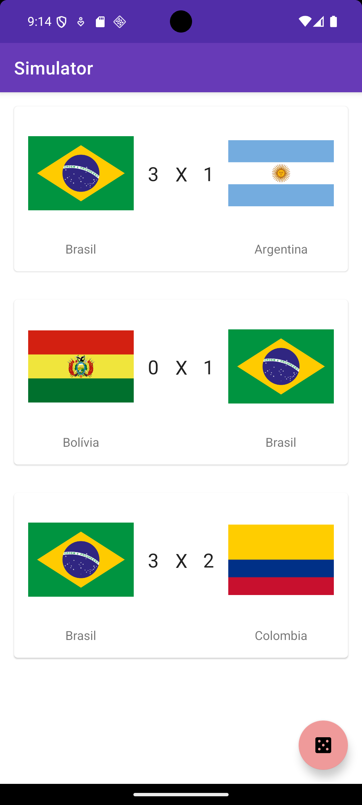

# 📱 Matches Simulator App — DIO Bootcamp Android

Aplicativo Android desenvolvido durante o **Bootcamp Android da DIO**, com o objetivo de praticar o consumo de APIs REST, exibição de listas e simulação de resultados de partidas.

O app consome dados de uma API pública e permite simular placares de forma aleatória.

---

## 🧠 Sobre o projeto

Este projeto foi criado com foco em consolidar conhecimentos fundamentais do desenvolvimento Android nativo, incluindo:

- Desenvolvimento Android com **Java**
- Consumo de API REST usando **Retrofit**
- Exibição de listas com **RecyclerView**
- Atualização de dados com **SwipeRefreshLayout**
- Uso de **ViewBinding**
- Simulação de resultados com lógica local

---

## 🛠️ Tecnologias utilizadas

- **Java**
- Android SDK
- Gradle
- Retrofit
- Gson
- RecyclerView
- Glide
- ViewBinding

---

## 📋 Pré-requisitos

Para rodar o projeto localmente, é necessário ter instalado:

- Android Studio (versão recomendada: Iguana ou superior)
- JDK 17
- Android SDK configurado
- Emulador Android ou dispositivo físico

---

## 🚀 Como rodar o projeto

### 1️⃣ Clone o repositório

```bash
git clone https://github.com/sinngjpeg/dio-bootcamp-android.git
```
### 2️⃣ Configure o SDK Android
Crie o arquivo local.properties na raiz do projeto com o caminho do SDK Android.

Windows:
```bash
sdk.dir=C:\\Users\\SEU_USUARIO\\AppData\\Local\\Android\\Sdk
```

macOs/Linux:
```bash
sdk.dir=/Users/seu-usuario/Library/Android/sdk
```
### 3️⃣ Abra no Android Studio

- Abra o projeto no Android Studio
- Aguarde a sincronização do Gradle
- Selecione um emulador ou dispositivo físico
- Clique em Run ▶️

## 🌐 API utilizada
O app consome dados da seguinte API pública:
https://sinngjpeg.github.io/dio-matches-simulator-api/

## 📁 Estrutura do projeto
````
app/
├── src/
│   └── main/
│       ├── java/
│       │   └── com.sinngjpeg.simulator
│       │       ├── data/
│       │       ├── domain/
│       │       └── ui/
│       └── res/
│       └── AndroidManifest.xml
````

## 📌 Observações

- Projeto desenvolvido para fins educacionais
- As versões de SDK refletem o período do bootcamp

## 📸 Demonstração do aplicativo

<p align="center">
  
</p>